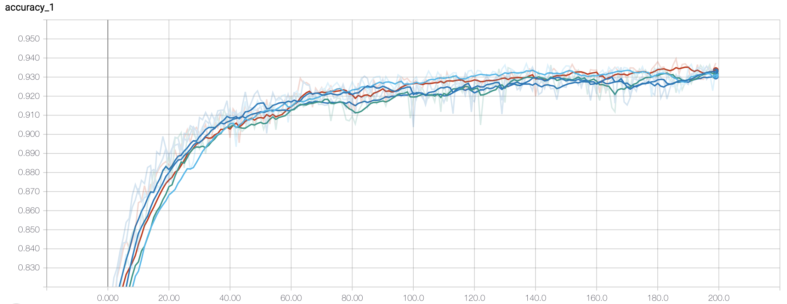
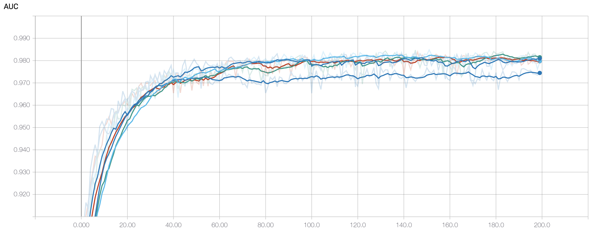

# plstm-supernovae

Code to classify supernovae based on their lightcurves. 

## Running

First unzip the data files in the data directory. Next preprocess the data by 

```
python dataset.py -preprocess
```
This will create a file for each supernova but grouped by observation time.

The SN1a classification can be run using the script
```
./run_sn1a.sh
```

These can be visualised using tensorboard
```
tensorboard --logdir logs
```

To visualise tensorboard remotely
```
ssh -L 16006:127.0.0.1:6006 user@remote
```

Then, on your local machine simply open 
```
http://127.0.0.1:16006/
```

## Results

The test accuracy and AUC are shown below training on a representational sample of 1106 supernovae in the SIMGEN dataset.






